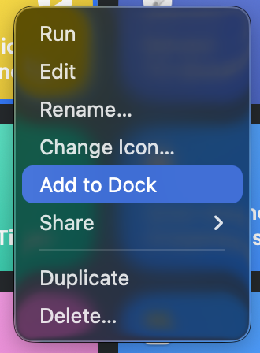
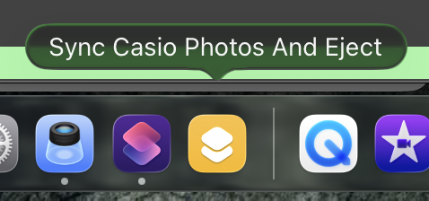
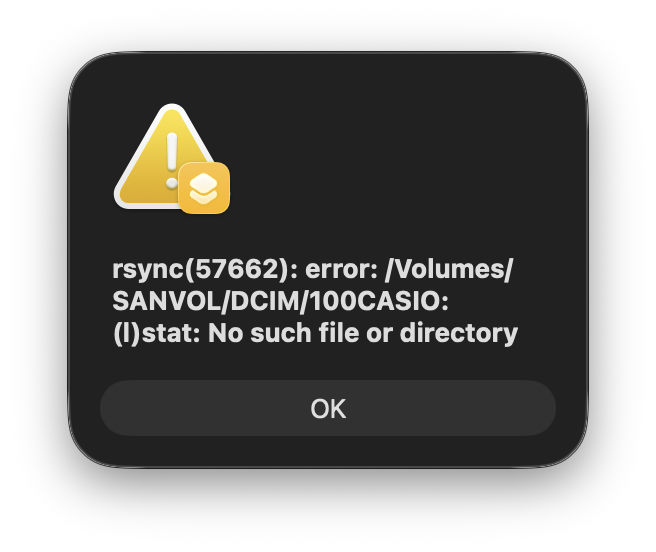

# Shortcuts.app as UI to rsync
macOS Shortcuts turns out to be a great [rsync](https://rsync.samba.org/)
launcher.

An example is my digital camera. When I plug in
the SD card, I typically have one objective:
copy the _new_ photos onto my hard drive, and eject
when finished.


The options I'm using here:
```
-u, --update
        Skip existing files on the destination that have a modification time newer than the source file.
```

iCloud does something weird with modification times (and sometimes I do things like rotate
the orientation), so the `-u` skips comparisons when destination files have newer timestamps.

```
-r, --recursive
        If source designates a directory, synchronise the directory and the entire subtree connected at that point.  If source ends with a slash, only the subtree is
        synchronised, not the source directory itself.  If source is a file, this has no effect.
```

Recursively copy the directory of photos.

Selecting the 'Eject' action target must be done when the drive to be ejected
is still mounted.

After saving, a launcher for the shortcut can be added to the dock by right clicking it:




The shortcut even has useful error messages when execution fails during
shell commands:



This is the output when launched without the SD card mounted.

When running, a menu-bar icon shows a loading state:


When complete, the icon shows a check mark:


After which point, I can safely physically remove the SD card.
